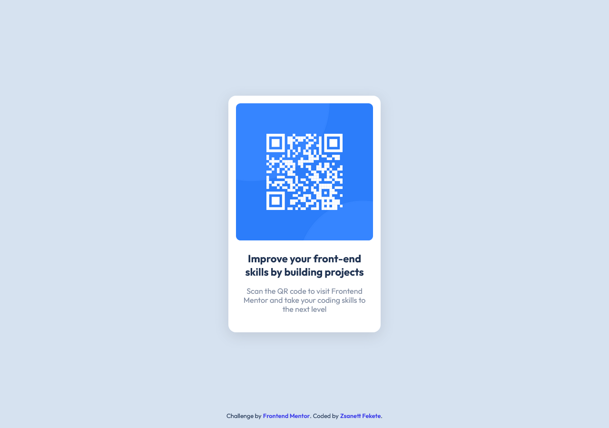
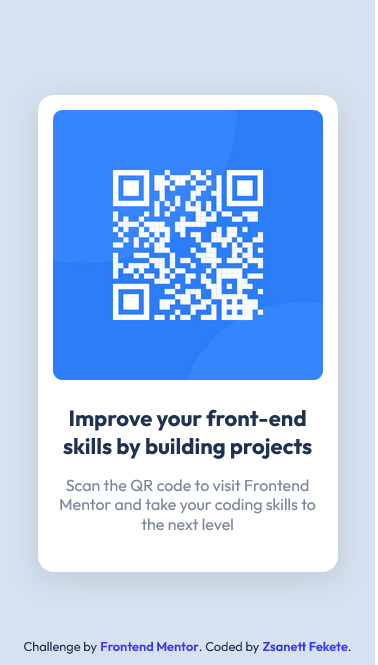

<h1 align="center">QR Code Component Solution</h1>

    <h3>
        <a href="https://qr-code-component-zsani.netlify.app/" target="_blank" title="https://qr-code-component-zsani.netlify.app/">Live</a>
         | 
        <a href="https://www.frontendmentor.io/solutions/qr-code-component-2eKO3hk7GT" target="_blank" title="https://www.frontendmentor.io/solutions/qr-code-component-2eKO3hk7GT">Solution</a>
         | 
        <a href="https://www.frontendmentor.io/challenges/qr-code-component-iux_sIO_H" target="_blank" title="https://www.frontendmentor.io/challenges/qr-code-component-iux_sIO_H">Challenge</a>
    </h3>

    This is a solution to the <a href="https://www.frontendmentor.io/challenges/qr-code-component-iux_sIO_H" target="_blank" title="https://www.frontendmentor.io/challenges/qr-code-component-iux_sIO_H">QR code component challenge on Frontend Mentor</a>. Frontend Mentor challenges help you improve your coding skills by building realistic projects.

<h2>The Challenge</h2>

Your challenge is to build out this QR code component and get it looking as close to the design as possible.

You can use any tools you like to help you complete the challenge. So if you've got something you'd like to practice, feel free to give it a go.

<h2>Built With</h2>
<h3>Technologies and Tools Used in This Project</h3>
<section align="center">
    
    
    
    
</section>
<h3>Features</h3>
<ul>
    <li><b>Responsive Design</b></li>
    
The website displays correctly on all devices. The interface automatically adapts to different screen sizes, ensuring a great user experience.
    
    <li><b>Semantic HTML5 Markup</b></li>
    
Clean and understandable HTML5 code.
    
    <li><b>CSS Custom Properties</b></li>
    
CSS variables help in centrally managing styles.

    <li><b>Flexbox Layout</b></li>
    
Flexible and efficient layout methods using CSS Flexbox. Flexbox allows for easy management and alignment of complex layouts.
              
</ul>
<h3>Useful Resources</h3>
<ul>
    <li align="justify"><b>PerfectPixel</b> is a Chrome extension used by web developers and designers to compare the actual appearance of a webpage with its design. This tool is particularly useful for achieving pixel-perfect development, ensuring that the implemented design matches the intended design accurately.</li>
    <li align="justify"><b>ColorZilla</b> is a popular Chrome extension used by web developers and designers for easy and quick color selection and analysis. With ColorZilla, you can effortlessly pick the color of any element on a webpage and it offers many other useful features for color management and analysis.</li>
</ul>
<h2>Mobile Version</h2>

    

<h2>Author</h2>
<ul>
    <li><b>Website</b> - <a href="https://zsanifekete.github.io/" target="_blank" title="https://zsanifekete.github.io/">zsanifekete.github.io</a></li>
    <li><b>Frontend Mentor</b> - <a href="https://www.frontendmentor.io/profile/zsanifekete" target="_blank" title="https://www.frontendmentor.io/profile/zsanifekete">@zsanifekete</a></li>
</ul>