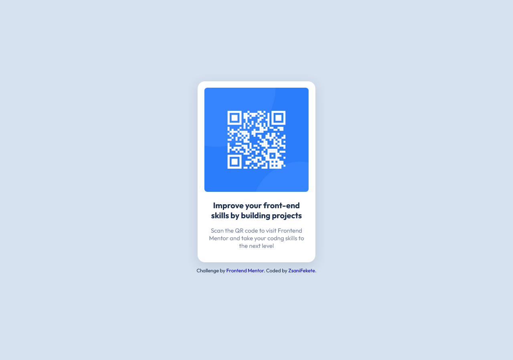
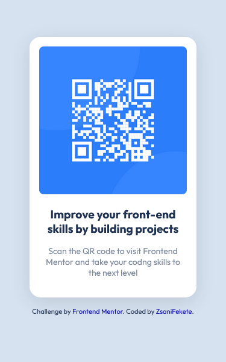

<h1 align="center" class="main-title">Qr code component solution</h1>

    <h3 align="center">
        <a href="https://zsanifekete.github.io/qr-code-component-challenge/" target="_blank">Live</a>
         | 
        <a href="">Solution</a>
         | 
        <a href="https://www.frontendmentor.io/challenges/qr-code-component-iux_sIO_H" target="_blank">Challenge</a>
    </h3>

    

        This is a solution to the <a href="https://www.frontendmentor.io/challenges/qr-code-component-iux_sIO_H">QR code component challenge on Frontend Mentor</a>. Frontend Mentor challenges help you improve your coding skills by building realistic projects.
    

<h2>The challenge</h2>

Your challenge is to build out this QR code component and get it looking as close to the design as possible.

You can use any tools you like to help you complete the challenge. So if you've got something you'd like to practice, feel free to give it a go.

<h2>Built with</h2>

<ul>
    <li>SASS</li>
    <li>Semantic HTML5 markup</li>    
    <li>CSS custom properties</li>    
    <li>Flexbox</li>        
    <li>Mobile-first workflow</li>        
</ul>

<h2>Useful resources</h2>

<ul>
    <li>
        <a href="https://www.w3schools.com/css/default.asp">W3Schools</a> - This is a free educational site for learning coding online .
    </li>
    <li>
        <a href="https://www.welldonecode.com/perfectpixel/">Perfect Pixel Extension</a> - This tool help me to the differences between the provided design and the created website.
    </li>
</ul>

<h2>Author</h2>

<ul>
    <li>Website: 
        <a href="https://zsanifekete.github.io/">zsanifekete.github.io</a>
    </li>
    <li>Frontend Mentor: 
        <a href="#">@zsanifekete</a>
    </li>
</ul>